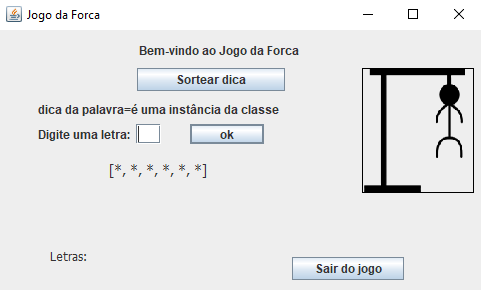

# Jogo da Forca
 Primeiro projeto realizado na disciplina de Programação Orientada a Objeto, envolvendo aplicação gráfica em Swing. 
 
 Integrantes: Gabriel Macaúbas Melo, Louise Fernandes Caetano e Samuel de Morais Lima.

